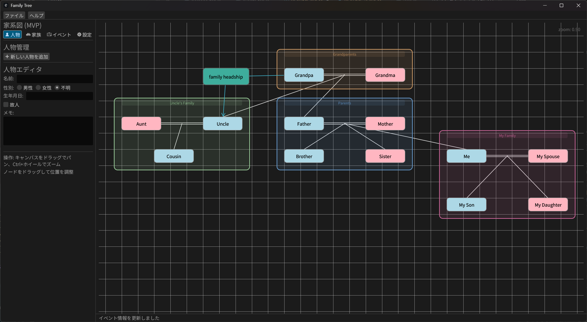
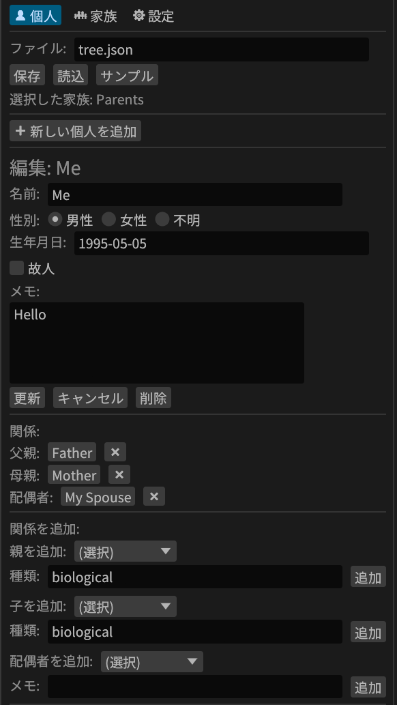
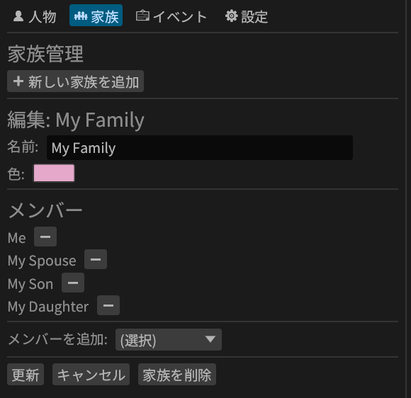

# Family Tree Creator

A modern, interactive family tree visualization application built with Rust and egui.


English | [日本語](README_ja.md)

## 📸 Screenshots


*Interactive canvas with sample family tree showing 4 generations*


*Person editor with relationship management*


*Color-coded family groups with visual boundaries*

## 🌟 Features

### Core Functionality
- **Interactive Canvas**: Drag-and-drop nodes to arrange your family tree
- **Pan & Zoom**: Navigate large family trees with smooth pan and zoom controls (Ctrl+Wheel)
- **Visual Relationships**: Clear lines connecting parents, children, and spouses
- **Multi-generational**: Support for unlimited generations

### Person Management
- **Rich Profiles**: Name, gender, birth/death dates, and custom memos
- **Deceased Status**: Special markers (†) for deceased family members
- **Age Calculation**: Automatic age calculation for living and deceased persons
- **Relationship Tracking**: Parents (biological/adoptive), children, and spouses
- **Editable Relations**: Edit relationship kinds (biological, adoptive, etc.) and spouse memos inline
- **Smart Positioning**: New persons appear at the top-left of the current canvas view

### Family Groups
- **Color-coded Groups**: Organize people into families with custom colors
- **Visual Boundaries**: Family groups displayed with colored backgrounds
- **Flexible Membership**: People can belong to multiple families

### User Interface
- **Bilingual Support**: Japanese and English interface
- **Three-panel Layout**: Persons, Families, and Settings tabs
- **Grid Alignment**: Optional grid display with snap-to-grid functionality
- **Dark/Light Themes**: Follows system theme preferences

### Data Management
- **JSON Storage**: Save and load family trees in human-readable JSON format
- **Sample Data**: Quick-start with pre-populated example family tree (16 people, 4 generations)
- **Position Memory**: Manual node positions are preserved
- **Comprehensive Tests**: 29 unit tests covering core functionality

## 🚀 Getting Started

### Prerequisites

- [Rust](https://www.rust-lang.org/tools/install) (2024 edition or later)
- Cargo (comes with Rust)

### Installation

1. Clone the repository:
```bash
git clone https://github.com/yourusername/family-tree-creator.git
cd family-tree-creator
```

2. Build and run:
```bash
cargo run --release
```

### Quick Start

1. **Load Sample Data**: Click the "Sample" button to load an example family tree with 16 people across 4 generations
2. **Add a Person**: Click "➕ Add New Person" in the Persons tab
3. **Edit Relationships**: Select a person and use the relationship controls to add parents, children, or spouses
4. **Arrange Nodes**: Drag nodes on the canvas to position them
5. **Save Your Work**: Enter a filename and click "Save"

## 📖 Usage Guide

### Creating Your Family Tree

#### Adding People

1. Navigate to the **Persons** tab
2. Click **➕ Add New Person**
3. Fill in the details:
   - **Name**: Person's full name
   - **Gender**: Male, Female, or Unknown
   - **Birth Date**: Format `YYYY-MM-DD` (e.g., `1990-05-15`)
   - **Deceased**: Check if person is deceased
   - **Death Date**: Format `YYYY-MM-DD` (only if deceased)
   - **Memo**: Additional notes
4. Click **Update** to save

#### Adding Relationships

1. Select a person from the list
2. Scroll to the **Relations** section
3. View existing relationships:
   - **Parents**: Father, mother, or other parents with relationship kind
   - **Spouses**: With marriage date/memo
   - Click ✏️ button to edit relationship kind or spouse memo
   - Click ❌ button to remove the relationship
4. Add new relationships:
   - **Add Parent**: Select parent and specify relationship kind (biological/adoptive)
   - **Add Child**: Select child and specify relationship kind
   - **Add Spouse**: Select spouse and add marriage date/memo

#### Creating Family Groups

1. Navigate to the **Families** tab
2. Click **➕ Add New Family**
3. Enter a family name and choose a color
4. Select family members from the dropdown
5. Click **Update** to save

### Canvas Controls

- **Pan**: Click and drag on empty canvas space
- **Zoom**: Hold Ctrl and scroll mouse wheel
- **Move Node**: Click and drag any person node
- **Select Person**: Click a node to select and edit

### Settings

Access the **Settings** tab to configure:
- **Language**: Switch between Japanese (日本語) and English
- **Grid**: Toggle grid display and adjust grid size
- **Layout**: Reset all positions to auto-calculated layout

## 🏗️ Project Structure

```
family-tree-creator/
├── src/
│   ├── main.rs           # Application entry point
│   ├── app.rs            # Main application state (276 lines)
│   ├── ui/               # UI modules (trait-based architecture)
│   │   ├── mod.rs        # Module declarations and trait exports
│   │   ├── persons_tab.rs    # Person management UI (~450 lines)
│   │   ├── families_tab.rs   # Family group management UI (~150 lines)
│   │   ├── settings_tab.rs   # Settings UI (~30 lines)
│   │   └── canvas.rs         # Canvas rendering (nodes, edges, interactions) (~480 lines)
│   └── core/             # Core logic modules
│       ├── mod.rs        # Module declarations
│       ├── tree.rs       # Data model (Person, Family, Relationships)
│       ├── layout.rs     # Layout engine and rendering utilities
│       └── i18n.rs       # Multilingual support (Japanese/English)
├── screenshots/      # Application screenshots
├── Cargo.toml            # Project dependencies
├── TODO.md               # Future feature roadmap
└── README.md             # This file
```

### Architecture

The application follows a clean, modular architecture:

- **Trait-Based UI**: Each UI component implements a trait on the `App` struct
  - `PersonsTabRenderer` - Person list, editor, and relationship management
  - `FamiliesTabRenderer` - Family group creation and member management
  - `SettingsTabRenderer` - Language and display settings
  - `CanvasRenderer` - Main canvas with multiple sub-traits:
    - `NodeRenderer` - Person node visualization
    - `EdgeRenderer` - Relationship lines (parent-child, spouse)
    - `FamilyBoxRenderer` - Family group boundaries
    - `NodeInteractionHandler` - Node dragging and selection
    - `PanZoomHandler` - Canvas navigation

- **Core Domain Logic**: Separated from UI concerns
  - `FamilyTree` - Person and relationship data structures
  - `LayoutEngine` - Automatic and manual positioning
  - `Texts` - Internationalization system

- **Testing**: 29 comprehensive unit tests covering core functionality

## 🛠️ Technical Stack

- **Language**: Rust 2024 edition
- **GUI Framework**: [egui](https://github.com/emilk/egui) 0.33.3 / [eframe](https://github.com/emilk/egui/tree/master/crates/eframe) 0.33.3
- **Serialization**: [serde](https://serde.rs/) with JSON
- **ID Generation**: [uuid](https://github.com/uuid-rs/uuid)

### Key Dependencies

```toml
[dependencies]
eframe = "0.33.3"
egui = "0.33.3"
serde = { version = "1.0", features = ["derive"] }
serde_json = "1.0"
uuid = { version = "1.11", features = ["v4", "serde"] }
```

## 📊 Data Format

Family trees are saved as JSON files with the following structure:

```json
{
  "persons": {
    "uuid": {
      "id": "uuid",
      "name": "John Doe",
      "gender": "Male",
      "birth": "1990-05-15",
      "deceased": false,
      "death": null,
      "memo": "Notes here",
      "position": [100.0, 200.0]
    }
  },
  "edges": [
    {
      "parent": "parent-uuid",
      "child": "child-uuid",
      "kind": "biological"
    }
  ],
  "spouses": [
    {
      "person1": "person1-uuid",
      "person2": "person2-uuid",
      "memo": "1990"
    }
  ],
  "families": [
    {
      "id": "family-uuid",
      "name": "Family Name",
      "members": ["uuid1", "uuid2"],
      "color": [200, 150, 100]
    }
  ]
}
```

## 🔮 Roadmap

See [TODO.md](TODO.md) for planned features, including:

- BC/AD notation for ancient family trees
- Enhanced date input (year-only format)
- Import/Export to GEDCOM format
- Photo attachments for people
- Timeline view
- Print-friendly layouts

## 🤝 Contributing

Contributions are welcome! Please feel free to submit a Pull Request.

1. Fork the repository
2. Create your feature branch (`git checkout -b feature/AmazingFeature`)
3. Commit your changes (`git commit -m 'Add some AmazingFeature'`)
4. Push to the branch (`git push origin feature/AmazingFeature`)
5. Open a Pull Request

## 📝 License

This project is licensed under the MIT License - see the LICENSE file for details.

## 🙏 Acknowledgments

- [egui](https://github.com/emilk/egui) - Immediate mode GUI framework
- [eframe](https://github.com/emilk/egui/tree/master/crates/eframe) - Application framework for egui
- Rust community for excellent tooling and libraries

## 📧 Contact

Project Link: [https://github.com/yourusername/family-tree-creator](https://github.com/yourusername/family-tree-creator)

---

**Note**: This is an MVP (Minimum Viable Product) version. More features are planned for future releases!
